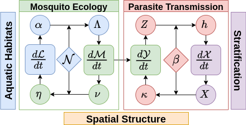

# exDE (Extensible Differential Equations for mosquito-borne pathogen modeling)

<!-- badges: start -->
[](https://github.com/dd-harp/exDE/actions)
[](https://app.codecov.io/gh/dd-harp/exDE)
<!-- badges: end -->

## What is exDE?

exDE provides tools to set up modular ordinary and delay differential equation spatial 
models for mosquito-borne pathogens, focusing on malaria. Modularity is achieved
by S3 dispatch on parameter lists for each component which is used to compute
the full set of differential equations. The function `xDE_diffeqn` computes the
gradient of all state variables from those modular components and can be used
with the excellent solver in [deSolve](http://desolve.r-forge.r-project.org/), or
any other differential equation solvers in R. exDE can be regarded as the continuous-time
companion to the discrete stochastic [Micro-MoB](https://github.com/dd-harp/MicroMoB)
framework.

To get started, please consider reading some of the articles in the dropdown panels above, at our [website](https://dd-harp.github.io/exDE/). The 3 sections ending in "Component" describe particular models implementing
the interface for each of those components (adult mosquitoes, aquatic mosquitoes, and humans), and show a simulation at their equilibrium values. The section "Articles" has more in-depth examples, including an extended walk through of how to set up and run a model in "5-3-4 Example". The section "Functions" documents each function exported by the package.

## Installation

To install from an R session, run the following lines of code.

```
library(devtools)
devtools::install_github("dd-harp/exDE")
```

## Contributing

For information about how to contribute to the development of exDE, please read our article on how to contribute at `vignette("Contribute")`!

## Modular Dynamics

Models for malaria transmission dynamics are naturally modular, structured by
vector life stage, host population strata, and by the spatial locations (patches) at
which transmission occurs (see figure below).

<p align="center">
  
</p>

Two components describe mosquito ecology: dynamics of immature mosquitoes in aquatic habitats $dL/dt$ (blue component); and dynamics of adult mosquitoes $dM/dt$ (green components). Adults lay eggs ($\nu$) that are allocated among the habitats ($\eta$). The matrix $\mathcal{N}$ describes the spatial arrangement of patches and aquatic habitats. Some eggs will develop and emerge as mature adults $\alpha$, which are added to the mosquito population at each patch $\Lambda$.

Two additional components describe parasite infection and transmission (red): parasite infection dynamics in mosquitoes, $dY/dt$ and parasite infection dynamics in humans (purple), described by $dX/dt$. The biting distribution matrix $\beta$ links biting from mosquitoes in each patch to the available human population from each strata, which depends on how people spend their time across the landscape. The density of infectious mosquitoes $Z$ is used to compute the force of infection on humans, $h$; likewise the infectious human population $X$ is used to compute the net infectiousness $\kappa$ of humans on mosquitoes.

The interactions among these modules take place for a stratified human population within a spatial domain structured into patches that contain the aquatic habitats.

### Adult Mosquitos

The generic functions which must be implemented for any specific model of adult mosquito dynamics are:

  * `F_EIR`:  compute $EIR$, which is a component in the force of infection $h$ upon humans.
  * `F_kappa`: computes $\kappa$, the net infectiousness of the human population to mosquitos.
  * `F_eggs`: compute $\nu$, the amount of eggs laid by mosquitos in each patch.
  * `dMYZdt`: compute the derivatives for all adult mosquitos (both uninfected $M$ and infected $Y$; $Z$ refers for infected _and_ infectious mosquitos, for models which make that distinction).

### Aquatic Mosquitos

The generic functions which must be implemented for any specific model of aquatic mosquito dynamics are:

  * `F_alpha`: compute $\alpha$, the rate of emergence of new adults from each aquatic habitat.
  * `dLdt`: compute the derivatives for aquatic mosquitos.
  
### Human Population

The generic functions which must be implemented for any specific model of human population dynamics are:

  * `F_x`: compute $X$, the net infectious population size.
  * `F_x_tau`: compute $X_{\tau}$, the lagged net infectious population size.
  * `dXdt`: compute the derivatives of the human population.

## Generalized equations

Because the framework does not make any assumptions on the specific internal dynamics
of each of the main components, only that they are able to provide the needed quantities
for the other components, a generalized set of differential equations can be written
to describe the dynamics of the system. Specific models can be used for each component
as needed. In `exDE` we use R's S3 dispatch to write generic differential equations
which can be specialized to specific models as needed.

The function `xDE_diffeqn` implements this generic differential equation model, which
has the following mathematical structure. This function is also responsible for computing
$\Lambda = \mathcal{U}\cdot\alpha$ and $\eta = \mathcal{N}\cdot\alpha$.
This structure is closely followed in the code.

$$
d{\mathcal{L}}/dt = F_{\mathcal{L}} \left(\eta, {\mathcal{L}} \right)
$$

$$
d {\mathcal{M}}/dt = F_{\mathcal{M}} \left(\Lambda, {\mathcal{M}} \right)
$$

$$
d {\mathcal{Y}}/dt = F_{\mathcal{Y}} \left(\kappa, {\mathcal{M}}, {\mathcal{Y}} \right)
$$

$$
d {\mathcal{X}}/dt = F_{\mathcal{X}} \left(E, {\mathcal{X}} \right)
$$

## Biting distribution

A core dynamical quantity that links the different components together is $\beta$, the biting distribution matrix. Let $n$ denote the number of strata in the human population, and $p$ the number of patches. We will always use $i$ to denote strata indices and $j$ to denote patch indices. 

### Human movement

We start with the fundamental matrix $\Psi$ which is of dimension $p\times n$ , where each column $i$ gives the distribution of time at risk for that strata over places (rows). If all strata are considered to be potentially at risk 100% of the time, then the columns will sum to one, which is the convention we will adopt for this document.

Then $\Psi_{ji}$ is the fraction of time that strata $i$ spends in patch $j$.

### Ambient human population

Let $H$ be a length $n$ column vector giving the population size of each strata. We want to know $W$, a length $p$ column vector which tells us how many people are at each patch (summing over all strata who are there).

We have $W = \Psi \cdot w_{f} H$, where $w_{f}$ is a length $n$ vector giving the biting weights of each human strata.

$$
W =\begin{bmatrix}
\sum_{i} \Psi_{1i}w_{f,i}H_{i} \\ \vdots \\ \sum_{i} \Psi_{pi}w_{f,i}H_{i}
\end{bmatrix}
$$

The elements of $W$ thus represent the amount of weighted person-time spent at each patch.

### Biting distribution matrix

The biting distribution matrix $\beta$ is a $n \times p$ matrix which is central to formulating mathematically consistent models of bloodfeeding, and, by extension, consistent models of mosquito-borne pathogen transmission

It is given by:

$$
\beta = \mbox{diag}(w_{f}) \cdot \Psi^{\top} \cdot \mbox{diag}(1/W)
$$

And it can be written component-wise as:

$$
\beta = \begin{bmatrix} 
\frac{\Psi_{11}w_{f,1}}{\sum_{i}\Psi_{1i}w_{f,i}H_{i}} & \cdots & \frac{\Psi_{p1}w_{f,1}}{\sum_{i}\Psi_{pi}w_{f,i}H_{i}} \\
\vdots & & \vdots \\
\frac{\Psi_{1n}w_{f,n}}{\sum_{i}\Psi_{1i}w_{f,i}H_{i}} & \cdots & \frac{\Psi_{pn}w_{f,n}}{\sum_{i}\Psi_{pi}w_{f,i}H_{i}} 
\end{bmatrix}
$$

Now we can get a clearer impression of what $\beta_{ij}$ is. It is the probability a bite from mosquitoes in patch $j$ lands on any particular person in strata $i$. Another way say this is that it is the proportion of person-time spent by a single person in strata $i$ at patch $j$, out of all person-time spent at that patch.

If we wanted to look at a matrix whose columns sum to unity and elements give the probability of a bite taken on the ambient population in patch $j$ to land on strata $i$, we could look at the following matrix:

$$
\mbox{diag}(H) \cdot \beta
$$

This operation has the effect of adding the column vector $H$ to the numerator of each column in $\beta$, so that the columns sum to one.

## Equilibrium

Because the framework is expressed generically, equilibrium solutions can be worked
out for each specific model independently, with input from other components assumed to
be constants. Models can be assembled at equilibrium from these individual model solutions.
Please see the vignettes for each specific model for closed-form solutions.
