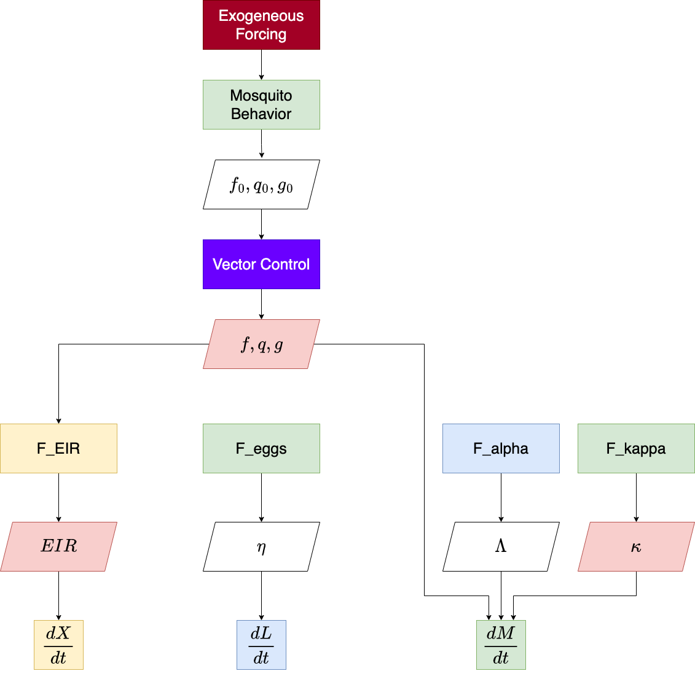

# exDE (Extensible Differential Equations for mosquito-borne pathogen modeling)

<!-- badges: start -->
[](https://github.com/dd-harp/exDE/actions)
[](https://app.codecov.io/gh/dd-harp/exDE)
[](https://www.medrxiv.org/content/10.1101/2022.11.07.22282044v1)
[](https://cran.r-project.org/package=exDE)
<!-- badges: end -->

## What is exDE?

exDE provides tools to set up modular ordinary and delay differential equation spatial 
models for mosquito-borne pathogens, focusing on malaria. Modularity is achieved
by method dispatch on parameter lists for each component which is used to compute
the full set of differential equations. The function `exDE::xDE_diffeqn` computes the
gradient of all state variables from those modular components and can be used
with the excellent solvers in [deSolve](http://desolve.r-forge.r-project.org/), or
other differential equation solvers in R. exDE can be regarded as the continuous-time
companion to the discrete stochastic [Micro-MoB](https://github.com/dd-harp/MicroMoB)
framework.

To get started, please consider reading some of the articles in the drop down panels above, at our [website](https://dd-harp.github.io/exDE/). The 3 sections ending in "Component" describe particular models implementing
the interface for each of those components (adult mosquitoes, aquatic mosquitoes, and humans), and show a simulation at their equilibrium values. 

The section "Articles" has more in-depth examples, including an extended walk through of how to set up and run a model in `vignette("ex_534")`, a guide on how to contribute, and an example of running a model in exDE with external forcing under a model of ITN (insecticide treated nets) based vector control in `vignette("vc_lemenach")`. 

The section "Functions" documents each function exported by the package.

## Installation

To install the latest version from GitHub, run the following lines of code in an R session.

```
library(devtools)
devtools::install_github("dd-harp/exDE")
```

Alternatively, you can install directly from [CRAN](https://cran.r-project.org/package=exDE) (please be aware that the version on CRAN may not be the latest version on GitHub):

```
install.packages("exDE")
```

## Contributing

For information about how to contribute to the development of exDE, please read our article on how to contribute at `vignette("Contributing")`!

## Model building in exDE

Models for mosquito borne pathogen transmission systems are naturally modular, structured by
vector life stage, host population strata, and by the spatial locations (patches) at
which transmission occurs (see figure below).

<p align="center">
  
</p>

Models in the exDE framework are constructed from 3 dynamical components:

  * $\mathcal{M}$: adult mosquitoes, whose dynamics are described by $d\mathcal{M}/dt$
  * $\mathcal{L}$: aquatic (immature) mosquitoes, whose dynamics are described by $d\mathcal{L}/dt$
  * $\mathcal{X}$: human population, whose dynamics are described by $d\mathcal{X}/dt$
  
The combined state from these 3 components is the entire state of the dynamical model, and their combined dynamics described by their differential equations represents the full endogenous dynamics of the system. In addition there are 2 more components which do not directly contribute to the state of the model, but instead modify parameters and compute intermediate quantities to represent external influences on the system. These are:

  * Exogenous forcing: weather, climate, unmodeled populations
  * Vector control: public health and mosquito control interventions which affect the dynamical components

There are also functions which handle the exchange of information (flows) between the dynamical components and which couple their dynamics. Bloodfeeding is the process by which adult mosquitoes seek out and feed on blood hosts, and results in the quantities $EIR$ (entomological inoculation rate) and $\kappa$, the net infectiousness of humans to mosquitoes, which couple the dynamics of $\mathcal{M}$ and $\mathcal{X}$. Likewise emergence of new adults from aquatic habitats and egg laying by adults into habitats couples $\mathcal{M}$ and $\mathcal{L}$. 

The function `exDE::xDE_diffeqn` compute the necessary quantities and returns a vector of derivatives of all state variables which can be used to solve trajectories from a model in exDE. The program flow within this function is summarized by this diagram:

<p align="center">
  
</p>

For more information, please read our [research article](https://www.medrxiv.org/content/10.1101/2022.11.07.22282044v1) describing the theory behind the model.
