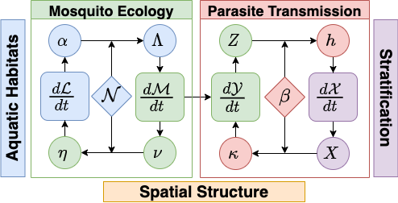

# exDE (Extensible Differential Equations for mosquito-borne pathogen modeling)

<!-- badges: start -->
[](https://github.com/dd-harp/exDE/actions)
[](https://app.codecov.io/gh/dd-harp/exDE)
[](https://www.medrxiv.org/content/10.1101/2022.11.07.22282044v1)
[](https://cran.r-project.org/package=exDE)
<!-- badges: end -->

## What is exDE?

exDE provides tools to set up modular ordinary and delay differential equation spatial 
models for mosquito-borne pathogens, focusing on malaria. Modularity is achieved
by method dispatch on parameter lists for each component which is used to compute
the full set of differential equations. The function `exDE::xDE_diffeqn` computes the
gradient of all state variables from those modular components and can be used
with the excellent solvers in [deSolve](http://desolve.r-forge.r-project.org/), or
other differential equation solvers in R. exDE can be regarded as the continuous-time
companion to the discrete stochastic [Micro-MoB](https://github.com/dd-harp/MicroMoB)
framework.

To get started, please consider reading some of the articles in the drop down panels above, at our [website](https://dd-harp.github.io/exDE/). The 3 sections ending in "Component" describe particular models implementing
the interface for each of those components (adult mosquitoes, aquatic mosquitoes, and humans), and show a simulation at their equilibrium values. 

The section "Articles" has more in-depth examples, including an extended walk through of how to set up and run a model in `vignette("ex_534")`, a guide on how to contribute, and an example of running a model in exDE with external forcing under a model of ITN (insecticide treated nets) based vector control in `vignette("vc_lemenach")`. 

The section "Functions" documents each function exported by the package.

## Installation

To install the latest version from GitHub, run the following lines of code in an R session.

```
library(devtools)
devtools::install_github("dd-harp/exDE")
```

Alternatively, you can install directly from [CRAN](https://cran.r-project.org/package=exDE) (please be aware that the version on CRAN may not be the latest version on GitHub):

```
install.packages("exDE")
```

## Contributing

For information about how to contribute to the development of exDE, please read our article on how to contribute at `vignette("Contributing")`! 

If you have any questions, comments, bug reports, or suggestions, the first point of contact with the development team is through [GitHub Issues](https://github.com/dd-harp/exDE/issues). If you are specifically submitting a bug report, please check out our [bug reporting guide](https://dd-harp.github.io/exDE/articles/Contributing.html#sec8). We welcome issues and encourage contribution regardless of experience; the length of the contributing guide is not intended to be intimidating, merely complete. It is the responsibility of the package maintainers to help new contributors understand our conventions and guide contributions to a successful conclusion.

## Model building in exDE

Models for mosquito borne pathogen transmission systems are naturally modular, structured by
vector life stage, host population strata, and by the spatial locations (patches) at
which transmission occurs (see figure below).

<p align="center">
  
</p>

Models in the exDE framework are constructed from 3 dynamical components:

  * $\mathcal{M}$: adult mosquitoes, whose dynamics are described by $d\mathcal{M}/dt$
  * $\mathcal{L}$: aquatic (immature) mosquitoes, whose dynamics are described by $d\mathcal{L}/dt$
  * $\mathcal{X}$: human population, whose dynamics are described by $d\mathcal{X}/dt$
  
The combined state from these 3 components is the entire state of the dynamical model, and their combined dynamics described by their differential equations represents the full endogenous dynamics of the system. In addition there are 2 more components which do not directly contribute to the state of the model, but instead modify parameters and compute intermediate quantities to represent external influences on the system. These are:

  * Exogenous forcing: weather, climate, unmodeled populations
  * Vector control: public health and mosquito control interventions which affect the dynamical components

There are also functions which handle the exchange of information (flows) between the dynamical components and which couple their dynamics. Bloodfeeding is the process by which adult mosquitoes seek out and feed on blood hosts, and results in the quantities $EIR$ (entomological inoculation rate) and $\kappa$, the net infectiousness of humans to mosquitoes, which couple the dynamics of $\mathcal{M}$ and $\mathcal{X}$. Likewise emergence of new adults from aquatic habitats and egg laying by adults into habitats couples $\mathcal{M}$ and $\mathcal{L}$. 

The function `exDE::xDE_diffeqn` compute the necessary quantities and returns a vector of derivatives of all state variables which can be used to solve trajectories from a model in exDE. The program flow within this function is summarized by this diagram:

<p align="center">
  
</p>

For more information, please read our [research article](https://www.medrxiv.org/content/10.1101/2022.11.07.22282044v1) describing the theory behind the model.

## Acknowledgements

Version 1.0 of this software was designed by Sean L. Wu and Professor David L. Smith. Most of the code was written by Sean L. Wu. We anticipate active development of exDE and MicroMoB to add new models to fill important needs. 

The idea of developing modular software to simulate the dynamics and control of mosquito-borne pathogens originated sometime around 2009 at the Emerging Pathogens Institute, University of Florida. It took much longer than anticipated to finish. Some concepts have appeared in various publications. Some of the algorithms trace back to other software packages that were never launched, but that someday might yet be completed (*e.g.*, MASH). In retrospect, a key challenge was blood feeding, but it was not the only one. 

From its inception, this project has been supported by grants from the Bill and Melinda Gates Foundation, including (most recently) **Modeling for Adaptive Malaria Control** (INV 030600, PI = David L Smith, University of Washington). The software is part of RAMP (Robust Analytics for Malaria Policy), the core analytical methodology being developed to support adaptive malaria control. The RAMP project includes a RAMP-UW team at the University of Washington based in Seattle Washington, and the RAMP-Uganda team based in Kampala, Uganda, which provides analytics support to the National Malaria Control Division, Ministry of Health, Uganda. 

Some model features were inspired by discussions with the mosquito working groups (led by Professor Thomas Scott) of RAPIDD (Research and Policy for Infectious Disease Dynamics). Over that time, the project benefited from the unwavering support and inspiration of the late F. Ellis McKenzie, Fogarty International Center.

Development of exDE was supported, in part, by a grant from the US National Institute of Allergies and Infectious Diseases (NIAID) to fund a project **Spatial Targeting and Adaptive Vector Control for Residual Transmission and Malaria Elimination in Urban African Settings** (R01 AI163398, PI = David L Smith), which has supported collaboration with the Bioko Island Malaria Elimination Program. Development of this software benefited from funding and collaboration with the NIAID grant **Program for Resistance, Immunology, Surveillance & Modeling of Malaria in Uganda (PRISM)** (2U19AI089674, PIs = Grant Dorsey, University of California San Francisco; and Moses Kamya, Infectious Diseases Research Collaboration), which was part of the International Centers of Excellence in Malaria Research (ICEMR) program. 

Funding to develop models of West Nile Virus to support Harris County Public Health was funded by the NSF as part of a project, **Computing the Biome** (PI= Janos Sztipanovits). The project was part of the Convergence Accelerator program of the National Science Foundation, Directorate for Technology, Innovation, and Partnerships (TIP) ([NSF 2040688 ](https://www.nsf.gov/awardsearch/showAward?AWD_ID=2040688 ) and [NSF 2040688](https://www.nsf.gov/awardsearch/showAward?AWD_ID=2134862), PI=Janos Sztipanovits, Vanderbilt University).


