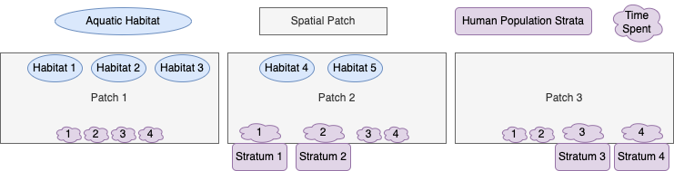

```{r, include = FALSE}
knitr::opts_chunk$set(
 collapse = TRUE,
 comment = "#>"
)
```

```{r, warning=FALSE, message=FALSE}
library(exDE)
#devtools::load_all(".")
library(expm)
library(data.table)
library(ggplot2)
library(deSolve)
```

# Introduction

We show how to setup, solve, and analyze models of mosquito-borne pathogen transmission dynamics and control using modular software. This vignette is designed to explain modular notation by constructing a model with five aquatic habitats ($l=5$), three patches ($p=3$), and four human population strata ($n=4$). We call it `5-3-4`.

## Diagram 

The model `5-3-4` is designed to illustrate some important features of the framework and notation. We assume that:

+ the first three habitats are found in patch 1; the last two are in patch 2; patch 3 has no habitats. 

+ patch 1 has no residents; patches 2 and 3 are occupied, each with two different population strata; 

+ Transmission among patches is modeled using the concept of *time spent*, which is similar to the *visitation rates* that have been used in other models. While the strata have a residency (i.e; a patch they spend most of their time in), each stratum allocates their time across all the habitats. 



# Parameters

We already know three important parameters, $l$, $p$ and $n$ because they are determined in the early stages of model building. The `exDE` package expects all parameters to be contained in a list object, containing `nHabitats`, `nPatches`, and `nStrata` which correspond to `l`, `p` and `n`.

```{r}
params = make_parameters_xde() 
params$nHabitats = 5
params$nPatches = 3
params$nStrata = 4
```

## Aquatic Habitat Membership Matrix

The aquatic habitat membership matrix $\mathcal{N}$ is a $p \times l$ matrix mapping aquatic habitats to the patches which contain them. It should be attached directly to the parameters list.

\begin{equation}
{\cal N} = \left[
 \begin{array}{ccccc} 
 1 & 1 & 1 & 0 & 0 \\ 
 0 & 0 & 0 & 1 & 1\\ 
 0 & 0 & 0 & 0 & 0\\ 
 \end{array} \right]
\end{equation}


```{r}
calN <- matrix(
 data = c(1,1,1,0,0,
      0,0,0,1,1,
      0,0,0,0,0), 
 nrow = params$nPatches, ncol = params$nHabitats, byrow = TRUE
)
params$calN <- calN
```

## Egg Dispersal Matrix

The egg dispersal matrix $\mathcal{U}$ is a $l \times p$ matrix describing how eggs laid by adult mosquitoes in a patch are allocated among the aquatic habitats in that patch. It is also attached directly to the parameters list.

\begin{equation}
{\cal U} = \left[
 \begin{array}{ccccc} 
 .7 & 0 & 0\\ 
 .2 & 0 & 0\\ 
 .1 & 0 & 0\\ 
 0 & .8 & 0\\ 
 0 & .2 & 0\\ 
 \end{array} \right]
\end{equation}

```{r}
xi <- matrix(c(.7, .2, .1, .8, .2), 5, 1) 
params$calU <- t(calN %*% diag(as.vector(xi)))
```

## Aquatic Mosquito Parameters

For this simulation, we use the basic competition model of larval dynamics (see more [here](aqua_basic.html)). It requires specification of three parameters, $\psi$ (maturation rates), $\phi$ (density-independent mortality rates), and $\theta$ (density-dependent mortality terms), and initial conditions. The function `exDE::make_parameters_L_basic` does basic checking of the input parameters and returns a list with the correct class for method dispatch. The returned list is attached to the main parameter list with name `Lpar`.

```{r}
L0 <- rep(1, params$nHabitats)
psi <- rep(1/8, params$nHabitats)
phi <- rep(1/8, params$nHabitats)
theta <- c(1/10, 1/20, 1/40, 1/100, 1/10) 

params = make_Lpar_basic(params, psi = psi, phi = phi, theta = theta)
params = make_Linits_basic(params, L0=L0)
```

## Adult Mosquito Parameters

We use the ODE version of the generalized Ross-Macdonald model (see more [here](adult_RM.html)). Part of the specification of parameters includes the construction of the mosquito dispersal matrix $\mathcal{K}$, and the mosquito demography matrix $\Omega$. Like for the aquatic parameters, we use `exDE::make_parameters_MYZ_RM_ode` to check parameter types and return a list with the correct class for method dispatch. We attach the returned list to the main parameter list with name `MYZpar`.

```{r}
g <- 1/12
sigma <- 1/12/2
f <- 1/3
q <- 0.9
nu <- c(1/3,1/3,0)  
eggsPerBatch <- 30 
eip <- 12 

calK <- t(matrix(
 c(c(0, .6, .3), 
  c(.4, 0, .7), 
  c(.6, .4, 0)), 3, 3))

M0 <- rep(100, params$nPatches)
P0 <- rep(10, params$nPatches)
Y0 <- rep(1, params$nPatches)
Z0 <- rep(0, params$nPatches)

Omega <- make_Omega(g, sigma, calK, params$nPatches)
Upsilon <- expm::expm(-Omega*eip)

params = make_MYZpar_RM(pars = params, g = g, 
                sigma = sigma, calK=calK, 
                eip=eip, f=f, q=q, nu=nu, 
                eggsPerBatch=eggsPerBatch, 
                solve_as = "ode") 

params = make_MYZinits_RM(params, M0=M0, P0=P0, 
             Y0=Y0, Z0=Z0)
```

## Human Parameters

## Mixing

In this model, we define four population strata. We can describe their residency with a vector describing residence: 

```{r}
residence = c(2,2,3,3)
searchWtsH = c(1,1,1,1)
``` 

Although not directly used in this example, we create the residency membership matrix $\mathcal{J}$, a $p \times n$ matrix indicating which patch each human population strata resides in.

\begin{equation}
{\cal J} = \left[
 \begin{array}{cccc} 
 0 & 0 & 0 & 0 \\ 
 1 & 1 & 0 & 0 \\ 
 0 & 0 & 1 & 1 \\ 
 \end{array} \right]
\end{equation}

```{r}
calJ <- t(matrix(
 c(c(0,0,0,0),
  c(1,1,0,0),
  c(0,0,1,1)), 4, 3
))
```

We then create the time at risk matrix $\Psi$, a $p \times n$ matrix describing how each human strata spends their time across patches.

\begin{equation}
\Psi= \left[
 \begin{array}{cccc}
 0.01 & .01 & .001 & .001 \\ 
 0.95 & .92 & .04 & .02 \\ 
 0.04 & .02 & .959 & .929 \\
 \end{array}
 \right] 
\end{equation}

```{r}
TaR <- t(matrix(
 c(c(0.01,0.01,0.001,0.001),
  c(.95,.92,.04,.02),
  c(.04,.02,.959,.929)), 4, 3
))
```

We use the basic SIS (Susceptible-Infected-Susceptible) model for the human component (see more [here](human_sis.html)). We set it up like the rest of the components, using `exDE::make_parameters_X_SIS` to make the correct return type, which is attached to the parameter list with name `Xpar`.

We use the null demographic model, which assumes a constant population size (constant $H$).

```{r}
H <- matrix(c(10,90, 100, 900), 4, 1)
params = setup_Hpar(params, HPop=H, residence=residence, searchWts=searchWtsH) 
params$Hpar$TaR <- TaR
```

```{r}
X0 <- as.vector(0.2*H)
r <- 1/200
b <- 0.55
c <- c(0.1, .02, .1, .02)

params = make_Xpar_SIS(pars = params, b = b, c = c, r = r)
params = make_Xinits_SIS(params, X0=X0)
```


# Simulation, the Long Way 

## Initial Conditions

After the parameters for `5-3-4` have been specified, we can generate the indices for the model and attach them to the parameter list.

```{r}
params = make_indices(params)
```

Now we can set the initial conditions of the model.

```{r}
y0 = get_inits(params)
```

## Numerical Solution

Now we can pass the vector of initial conditions, `y`, our parameter list `params`, and the function `exDE::xDE_diffeqn` to the differential equation solvers in `deSolve::ode` to generate a numerical trajectory. The classes of `Xpar`, `MYZpar`, and `Lpar` in `params` will ensure that the right methods are invoked (dispatched) to solve your model.

```{r}
out <- deSolve::ode(y = y0, times = 0:365, 
                    func = xDE_diffeqn, parms = params, method = "lsoda")
out1 <- out
```

## Plot Output

With a small amount of data wrangling made easier by the `data.table` package, we can plot the output.

```{r, out.width = "100%"}
colnames(out)[params$Lpar$L_ix+1] <- paste0('L_', 1:params$nHabitats)
colnames(out)[params$MYZpar$M_ix+1] <- paste0('M_', 1:params$nPatches)
colnames(out)[params$MYZpar$P_ix+1] <- paste0('P_', 1:params$nPatches)
colnames(out)[params$MYZpar$Y_ix+1] <- paste0('Y_', 1:params$nPatches)
colnames(out)[params$MYZpar$Z_ix+1] <- paste0('Z_', 1:params$nPatches)
colnames(out)[params$Xpar$X_ix+1] <- paste0('X_', 1:params$nStrata)

out <- as.data.table(out)
out <- melt(out, id.vars = 'time')
out[, c("Component", "Stratification") := tstrsplit(variable, '_', fixed = TRUE)]
out[, variable := NULL]

ggplot(data = out, mapping = aes(x = time, y = value, color = Stratification)) +
 geom_line() +
 facet_wrap(. ~ Component, scales = 'free') +
 theme_bw()
```

# Using Setup 

We create lists with all our parameters values: 

```{r}
MYZo = list(
 solve_as = "ode", 
 g = 1/12, sigma = 1/12/2,
 f = 1/3, q=0.9, nu=c(1/3,1/3,0),
 eggsPerBatch = 30, 
 eip = 12, 
 M0 = 100,  P0 = 10,  Y0 = 1, Z0 = 0 
)
```

```{r}
Lo = list(
 L0 = 1,
 psi = 1/8, phi = 1/8, 
 theta = c(1/10, 1/20, 1/40, 1/100, 1/10) 
) 
```

```{r}
Xo = list(
 X0 = as.vector(0.2*H),
 r = 1/200,
 b = 0.55,
 c = c(0.1, .02, .1, .02)
)
```


```{r}
xde_setup("mod534", "RM", "SIS", "basic", 
                  nPatches = 3, HPop=c(10, 90, 100, 900), 
                  membership=c(1,1,1,2,2), 
                  MYZopts=MYZo, calK=calK, Xopts=Xo, 
                  residence=c(2,2,3,3), searchB=searchWtsH, 
                  TaR=TaR, searchQ = c(7,2,1,8,2), Lopts = Lo) -> mod534
```

We solve and take the differences to check: 

```{r}
mod534 <- xde_solve(mod534,Tmax=365,dt=1)
mod534$outputs$orbits$deout -> out2
sum(abs(out2-out1))
```

Interestingly, the differences are small: 

```{r}
approx_equal(tail(out2, 1), tail(out1,1), tol = 1e-6)
```

After some sleuthing, it appears that these arise from a very small difference in $\cal U$. Note that `mod534$calU` appears to match `params$calU`:

```{r}
mod534$calU
```
but there is a very small difference that only shows up by taking the difference: 

```{r}
mod534$calU - params$calU
```

We can test the idea:

```{r}
mod534$calU = params$calU
mod534 <- xde_solve(mod534,Tmax=365,dt=1)
mod534$outputs$orbits$deout -> out2
sum(abs(out2-out1))
```

```{r}
out2l = parse_deout(out2, mod534)
names(out2l)
```


