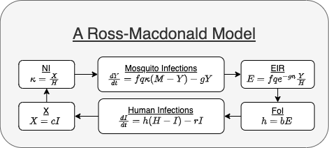

## Introduction


**Modular forms** for disease dynamics are stylized ways of writing the dynamical systems that emphasize the modularity. A mathematical basis and modular framework for building models describing the dynamics and control of malaria and other mosquito-borne pathogens was described in [Spatial Dynamics of Malaria Transmission](https://journals.plos.org/ploscompbiol/article?id=10.1371/journal.pcbi.1010684){target="_blank"}, and the framework was implemented in `exDE.` The forms we describe here are a natural way of rewriting models that closely resembles their implementation in `exDE`, which makes it possible to relate written equations and computed code. (Also, see the closely related vignette 
[Understanding exDE](Understanding_exDE.html){target="_blank"}.)

## The Modular Form

To illustrate how this process works, we start by writing a Ross-Macdonald model in its modular form (Figure 1). 

*** 



*** 

### Parasite Infection Dynamics in Humans 

The equation describing human infections is written in the following way:

$$
dI/dt = h (H-I) - r I
$$

where:

+ $I$ is the density of infected and infectious humans;

+ $H$ is the density of humans;

+ $h$ is the force of infection (FoI), the number of infections, per perspon, per day; 

+ $r$ is the clearance rate, the number of infections that clear, per infected person, per day. 

### Parasite Infection Dynamics in Mosquitoes 

Similarly, the equation describing infected mosquitoes is the following: 

$$
dY/dt = a\kappa (M-Y) - g Y
$$

where:

+ $Y$ is the density of infected mosquitoes; 

+ $M$ is the density of mosquitoes; 

+ $a$ is the mosquito human blood feeding rate, the number of human blood meals, per mosquito, per day;  

+ $\kappa$ is the net infectiousness (NI) of humans, the probability a mosquito would become infected after blood feeding on a human;

+ $g$ is the mosquito death rate, the number of mosquitoes dying, per mosquito, per day;   

### Blood Feeding 

There are two **terms,** the FoI ($h$) and the NI ($\kappa$), in the equations above that rely on information that comes from the other equation. In the generic form, the computation of these terms defines the blood feeding model, which is the interface between $\cal YZ$ and $\cal X.$

#### FoI 

The FoI $h$ must be related to the density of infected mosquitoes. We compute this in several steps. First, in this Ross-Macdonald model, the density of blood feeding mosquitoes is given by a formula: 
$$Z = F_Z(Y) = e^{-gn} Y$$ 
Next, we need to compute the EIR, which is
$$a \frac ZH$$
and finally, we must compute the FoI, which could draws information from many different sources, : 

$$ h = F_h(E, ...) = b E$$ 

where:

+ $b$ is the fraction of infective bites that cause an infection; 
    
+ $n$ is the extrinsic incubation period (EIP) 

#### NI  

The NI $\kappa$ must be related to the density of infected humans. In the Ross-Macdonald model: 

$$X = F_X(I) = cI$$ 

$$\kappa =  F_\kappa(X, ...) = \frac XH$$
where 
+ $c$ is the probability a mosquito would become infected after blood feeding on an infected human. 

## Classical Form 

If we had wanted to write this all down in the ordinary way, the model would look like this:

$$ \begin{array}{rl}
dX/dt &= b e^{-gn}\frac YH (H-X) - r X \\
dY/dt &= a c \frac XH (M-Y) - g Y
\end{array}$$

## Computation

To solve these equations, we need to write functions that compute the derivatives. We are using the R package `deSolve`, so the derivative function would have a constrained form:  

```{r}
RMv1 <- function(t, y, pars) {
  with(pars,{
      foi = b*exp(-g*n)*Y/H
      kappa = c*X/H
      dX = foi*(H-X) - r*X
      dY = a*kappa*(M-Y) - g*Y 
      return(list(dX, dY))
  })
}
```

In `exDE,` the equations are solved by computing the terms and the derivatives separately. 

+ `Transmission(t,y,pars)` computes three terms, attached to the main model object `pars`:

    - pars$beta 
    
    - pars$EIR
    
    - pars$NI

The density of infected humans in this model is $X$, but 

```{r}
RMv2 <- function(t, y, pars) {
  with(pars,{
      pars = Transmission(t, y, pars)
      pars = Exposure(t, y, pars)
      dX = dXdt(t, y, pars) 
      dY = dMYZdt(t, y, pars) 
      return(list(dX, dY))
  })
}
```
